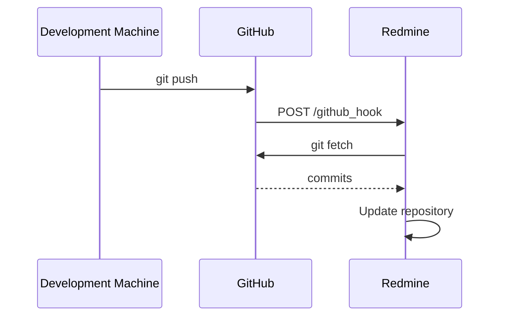

# Redmine GitHub Hook

This plugin allows you to update your local Git repositories in Redmine when changes have been pushed to GitHub.

## Project Status: Looking for maintainers

This project is not under active development, although I will continue to provide support for current users, but you can change that by joining the team.

If you use this project and would like to develop it further, please introduce yourself on the [maintainers wanted ticket](https://github.com/koppen/redmine_github_hook/issues/96).

## Description

[Redmine](http://redmine.org) has supported Git repositories for a long time, allowing you to browse your code and view your changesets directly in Redmine. For this purpose, Redmine relies on local clones of the Git repositories.

If your shared repository is on a remote machine - for example on GitHub - this unfortunately means a bit of legwork to keep the local, Redmine-accessible repository up-to-date. The common approach is to set up a cronjob that pulls in any changes with regular intervals and updates Redmine with them.

That approach works perfectly fine, but is a bit heavy-handed and cumbersome. The Redmine GitHub Hook plugin allows GitHub to notify your Redmine installation when changes have been pushed to a repository, triggering an update of your local repository and Redmine data only when it is actually necessary.

## Getting started

### 1. Install the plugin

1. Add the gem to your Gemfile.local:
   `gem "redmine_github_hook"`
2. `bundle`
3. Run migrations: `bundle exec rake redmine:plugins:migrate RAILS_ENV=production`
4. Restart your Redmine

### 2. Add the repository to Redmine

Adding a Git repository to a project (note, this should work whether you want to use Redmine GitHub Hook or not).

1. Simply follow the instructions for [keeping your git repository in sync](http://www.redmine.org/wiki/redmine/HowTo_keep_in_sync_your_git_repository_for_redmine).
 * You don't need to set up a cron task as described in the Redmine instructions.

### 3. Connecting GitHub to Redmine

1. Go to the repository Settings interface on GitHub.
2. Under "Webhooks & Services" add a new "WebHook". The "Payload URL" needs to be of the format: `[redmine_url]/github_hook` (for example `http://redmine.example.com/github_hook`).
   * By default, GitHub Hook assumes your GitHub repository name is the same as the *project identifier* in your Redmine installation.
     * If this is not the case, you can specify the actual Redmine project identifier in the Post-Receive URL by using the format `[redmine_url]/github_hook?project_id=[identifier]` (for example `http://redmine.example.com/github_hook?project_id=my_project`).
     * GitHub Hook will then update **all repositories** in the specified project. *Be aware, that this process may take a while if you have many repositories in your project.*
     * If you want GitHub Hook to **only update the current repository** you can specify it with an additional parameter in the Post-Receive URL by using the format `[redmine_url]/github_hook?project_id=[identifier]&repository_id=[repository]` (for example `http://redmine.example.com/github_hook?project_id=my_project&repository_id=my_repo`).
   * In most cases, just having the "push" event trigger the webhook should suffice, but you are free to customize the events as you desire.
   * *Note: Make sure you're adding a Webhook - which is what Redmine Github Hook expects. GitHub has some builtin Redmine integration; that's not what you're looking for.*

That's it. GitHub will now send a HTTP POST to the Redmine GitHub Hook plugin whenever changes are pushed to GitHub. The plugin then takes care of pulling the changes to the local repositories and updating the Redmine database with them.

## Assumptions

* Redmine running on a *nix-like system. Redmine versions before 2.0 should use the redmine_1.x branch. This gem has been reported to work with Redmine version 5.x, 4.x, 3.x., 2.x.
* Git 1.5 or higher available on the commandline.

## Troubleshooting

### Check your logfile

If you run into issues, your Redmine logfile might have some valuable information. Two things to check for:

1. Do POST requests to `/github_hook` show up in the logfile at all? If so, what's the resulting status code?
2. If the git command used to pull in changes fails for whatever reason, there should also be some details about the failure in the logfile.

The logfile is usually found in your Redmine directory in `log/production.log` although your webserver logs may contain some additional clues.

### Permissions problems

As for permissions, whatever user Redmine is running as needs permissions to do the following things:

* Read from the remote repository on GitHub
* Read and write to the local repository on the Redmine server

What user you are running Redmine as depends on your system and how you've setup your Redmine installation.

#### GitHub

This means you need to add its SSH keys on GitHub. If the user doesn't already have an SSH key, generate one and add the public SSH key as a Deploy Key for the repository on GitHub (or as one of your own keys, if you prefer that).

#### Local repository

The user running Redmine needs permissions to read and write to the local repository on the server.

## What happens

The interactions between the different parts of the process is outlined in the following sequence diagram:

## License

Distributed under the MIT License. See LICENSE for more information.
